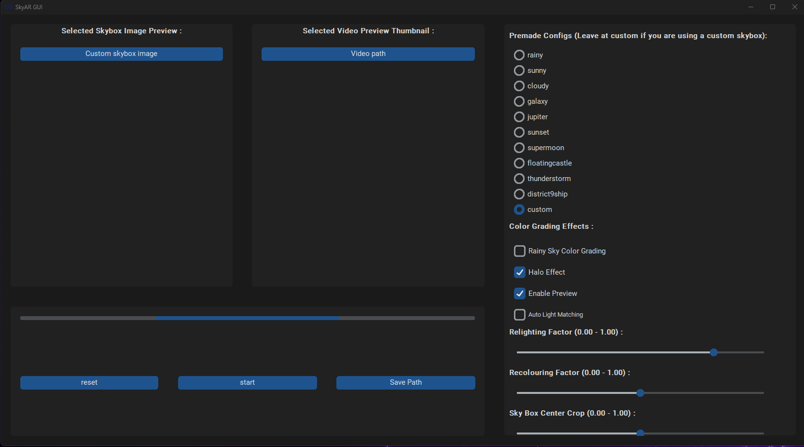
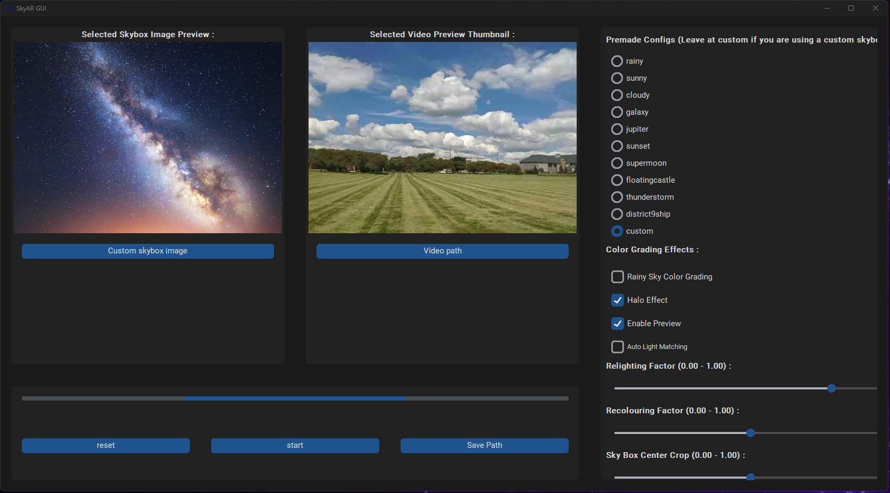
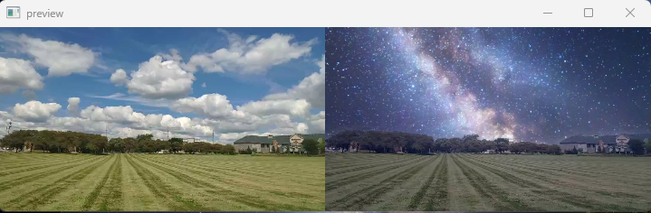
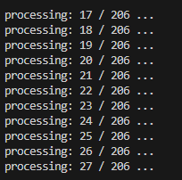

# SkyAR GUI: Real-time Video Sky Replacement

SkyAR GUI is a user-friendly graphical interface for SkyAR, a vision-based method for real-time video sky replacement and harmonization. This repository provides an intuitive platform for users to leverage SkyAR's capabilities without the need for extensive coding knowledge.

## SkyAR GUI Demo

### Table of Contents
1. [About SkyAR GUI](#about-skyar-gui)
2. [How Does It Work?](#how-does-it-work)
3. [System Requirements](#system-requirements)
4. [How to Use It](#how-to-use-it)
5. [GUI Components](#gui-components)
6. [Screenshots](#screenshots)
7. [Contributing](#contributing)
8. [License](#license)
9. [Acknowledgments](#acknowledgments)

## About SkyAR GUI
SkyAR GUI is a graphical interface designed to simplify the process of utilizing the SkyAR method for video sky replacement. It provides an intuitive platform for users to replace sky backgrounds in videos with ease, without requiring extensive technical expertise.

## How Does It Work?
SkyAR GUI utilizes computer vision techniques to automatically generate realistic and dramatic sky backgrounds in videos. The process involves the following steps:
- Sky Matting: Identifying and isolating the sky region in each frame of the video.
- Motion Estimation: Estimating the motion dynamics in the video to ensure smooth blending of the replacement sky.
- Image Blending: Seamlessly blending the replacement sky into the video frames, considering lighting and motion dynamics.

## System Requirements
SkyAR GUI has the following system requirements:
- **Operating System:** Windows, macOS, Linux
- **Python:** Version 3.8
- **Dependencies:** 
  - `pyglet`
  - `customtkinter`
  - `paddlepaddle`
  - `opencv-python`
  - `scikit-learn`
  - `PIL`
  - `setuptools`
  - `wheel`
  
Please ensure you have Python 3.8 installed and install the necessary dependencies listed above.

## How to Use It
To use SkyAR GUI:
1. Clone this repository to your local machine.
2. Install the necessary dependencies using:  `pip install pyglet customtkinter paddlepaddle opencv-python scikit-learn Pillow setuptools wheel`
3. Navigate to the SkyAR_GUI-main directory.
4. Run `GUI_Anshul.py` to launch the GUI.
5. Use the following GUI components (explained below) to customize your sky replacement settings.
6. Click "Start" to initiate the sky replacement process.
7. Specify the save path to store the processed video output.

## GUI Components
1. **Selected Skybox Image Preview:** Provides a preview of the currently selected skybox image.
2. **Selected Video Preview Thumbnail:** Displays a thumbnail preview of the selected video.
3. **Premade Configurations:** Offers predefined configurations for sky replacement, including options like rainy, sunny, cloudy, and more.
4. **Color Grading Effects:** Provides options for enhancing the visual effects of the sky replacement, including rainy sky color grading, halo effect, and auto-light matching.
5. **Relighting Factor:** Adjusts the intensity of the lighting effect on the replacement sky (0.00-1.00).
6. **Recoloring Factor:** Modifies the color intensity and saturation of the replacement sky (0.00-1.00).
7. **Sky Box Center Crop:** Defines the cropping factor for centering the sky box within the video frame (0.00-1.00).
8. **Reset:** Resets all parameters and settings to their default values.
9. **Start:** Initiates the sky replacement process with the selected configurations and settings.
10. **Save Path:** Specifies the directory path for saving the modified video file.

## Screenshots
1. 
2. 
3. 
4. 

## Contributing
Contributions to SkyAR GUI are welcome! If you encounter any bugs, have feature requests, or want to contribute enhancements, feel free to submit pull requests.

## License
This project is licensed under the MIT License. See the `LICENSE` file for details.

## Acknowledgments
We thank the authors of the SkyAR method for their groundbreaking work.
